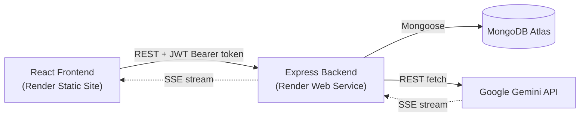

# BrainBot 

A full-stack MERN AI chatbot with multi-threaded conversations, streaming responses, and a complete admin panel for user and conversation management.

[](https://nodejs.org/)
[](https://react.dev/)
[](https://www.mongodb.com/)
[](https://render.com/)

---

## Table of Contents

- [Live Demo](#live-demo)
- [Project Overview](#project-overview)
- [Features](#features)
- [Tech Stack](#tech-stack)
- [System Architecture](#system-architecture--how-it-works)
- [API Documentation](#api-documentation)
- [Database](#database)
- [Authentication & Authorization](#authentication--authorization)
- [Environment Variables](#environment-variables)
- [Local Installation & Setup](#local-installation--setup)
- [Running the Project](#running-the-project)
- [Deployment on Render](#deployment-on-render)
- [Future Improvements](#future-improvements)
- [Known Limitations](#known-limitations)
---

## Live Demo

🔗 *https://brainbot-1-py6y.onrender.com*

## GitHub Repository

🔗 `https://github.com/aditified/BrainBot`

---

## Project Overview

BrainBot is a ChatGPT-style AI chatbot application built to let users hold persistent, multi-threaded conversations with an AI assistant powered by Google's Gemini API. Unlike a simple single-session chatbot, BrainBot keeps a full history of every conversation thread per user, streams AI responses token-by-token for a natural typing feel, and includes a role-based admin panel so an administrator can monitor usage, manage users, and review conversations across the platform.

It solves the common problem of quick AI-chat demos that don't persist state or scale to multiple users — BrainBot has real user accounts, isolated per-user chat history, and moderation tooling, making it closer to a small-scale production chat product than a single-file demo.

## Features

**User-facing:**
- Email/password signup and login
- Multiple, independently named chat threads per user
- Real-time streaming AI responses (text appears as it's generated)
- Edit a previous message and regenerate the AI's reply from that point
- Delete individual chat threads
- Markdown rendering with syntax-highlighted code blocks in AI responses
- Animated 3D mascot (Spline) on the login/signup screens
- Collapsible sidebar, responsive chat layout

**Admin-facing (role-gated):**
- Dashboard with live stats: total users, total conversations, total messages, messages sent today, active users today
- Recent activity feed across all users
- User management: search, view detail, block/unblock, delete (cascades to that user's threads)
- Safeguard: an admin account cannot be blocked (including by itself)
- Full chat history browser across all users with search
- Analytics: messages-per-day (last 7 days) bar chart, most active users
- Admin profile settings: update name, change password

**Technical:**
- JWT-based stateless authentication (7-day expiry)
- bcrypt password hashing
- Server-Sent Events (SSE) streaming from Gemini through the Express backend to the React frontend
- Retry logic for Gemini API rate-limit/overload responses
- SPA client-side routing with a Render rewrite rule for deep-link refresh support

## Tech Stack

| Layer | Technology |
|---|---|
| **Frontend** | React 19, Vite 7, React Router 7 |
| **Backend** | Node.js, Express 5 |
| **Database** | MongoDB (via Mongoose 8), hosted on MongoDB Atlas |
| **Authentication** | JSON Web Tokens (`jsonwebtoken`) + `bcryptjs` |
| **AI Provider** | Google Gemini API (`gemini-3.6-flash`), called directly via REST `fetch` |
| **Deployment** | Render (Backend as Web Service, Frontend as Static Site) |
| **Other libraries** | `react-markdown` + `rehype-highlight` (Markdown/code rendering), `@splinetool/react-spline` (3D mascot), `react-spinners` (loading UI), `uuid` (thread ID generation), Font Awesome (CDN), Google Fonts |

## System Architecture / How It Works



1. The user logs in or signs up from the React frontend; the backend verifies credentials, hashes/checks the password with bcrypt, and returns a signed JWT.
2. The frontend stores the JWT and user object in `localStorage` and attaches the token as a `Bearer` header on every subsequent API request.
3. Protected routes on the backend run through a `protect` middleware that verifies the JWT and checks the user still exists and isn't blocked; admin-only routes additionally run through an `adminOnly` middleware.
4. For chat, the frontend sends the user's message to `/api/chat`. The backend saves the message to the correct MongoDB `Thread` document, then calls Gemini's streaming endpoint and forwards each text chunk to the frontend as a Server-Sent Event, which the frontend renders progressively.
5. Admin routes aggregate data directly from the `User` and `Thread` collections (counts, recent activity, per-day message buckets) and return it to the admin dashboard.


## API Documentation

Base URL: https://brainbot-91mj.onrender.com

### Auth Routes — `/api/auth`

| Method | Endpoint | Description | Auth Required | Body |
|---|---|---|---|---|
| POST | `/api/auth/signup` | Create a new user account | No | `{ name, email, password }` |
| POST | `/api/auth/login` | Log in, returns JWT + user object | No | `{ email, password }` |

### Chat Routes — `/api`

| Method | Endpoint | Description | Auth Required | Body |
|---|---|---|---|---|
| GET | `/api/thread` | Get all threads for the logged-in user | Yes | — |
| GET | `/api/thread/:threadId` | Get all messages in a specific thread | Yes | — |
| POST | `/api/chat` | Send a message, streams the AI reply via SSE | Yes | `{ threadId, message }` |
| PUT | `/api/thread/:threadId/message/:messageId` | Edit a message and regenerate the reply from that point | Yes | `{ content }` |
| DELETE | `/api/thread/:threadId` | Delete a thread | Yes | — |

### Admin Routes — `/api/admin` (requires `isAdmin: true`)

| Method | Endpoint | Description | Auth Required |
|---|---|---|---|
| GET | `/api/admin/dashboard` | User/message/conversation counts + recent activity | Admin |
| GET | `/api/admin/users?search=` | List/search all users | Admin |
| GET | `/api/admin/users/:userId` | Get one user's detail + thread count | Admin |
| PATCH | `/api/admin/users/:userId/block` | Toggle block status on a user (admins exempt) | Admin |
| DELETE | `/api/admin/users/:userId` | Delete a user and all their threads | Admin |
| GET | `/api/admin/threads?search=` | List/search all conversations | Admin |
| GET | `/api/admin/threads/:threadId` | View a specific conversation | Admin |
| DELETE | `/api/admin/threads/:threadId` | Delete a conversation | Admin |
| GET | `/api/admin/analytics` | Messages-per-day (7 days) + most active users | Admin |
| PUT | `/api/admin/profile` | Update admin's own name/password | Admin |

## Database

MongoDB (Atlas-hosted), accessed via Mongoose. Two collections:

**`User`**
| Field | Type | Notes |
|---|---|---|
| name | String | required |
| email | String | required, unique |
| password | String | bcrypt-hashed, required |
| isAdmin | Boolean | default `false` |
| isBlocked | Boolean | default `false` |
| createdAt | Date | default `now` |

**`Thread`**
| Field | Type | Notes |
|---|---|---|
| threadId | String | required, unique (client-generated UUID) |
| userId | ObjectId | ref `User`, required |
| title | String | default `"New Chat"`, set to first message |
| messages | Array | embedded subdocuments: `{ role: "user"\|"assistant", content, timestamp }` |
| createdAt / updatedAt | Date | timestamps |

Each thread is scoped to a single `userId`, so users can never see or modify each other's conversations — this is enforced at the query level (`Thread.find({ userId: req.userId })`) in every non-admin route.

## Authentication & Authorization

- Passwords are hashed with **bcrypt** (10 salt rounds) before being stored — plaintext passwords are never persisted.
- On successful login/signup, the server signs a **JWT** (`jsonwebtoken`) containing the user's ID, valid for **7 days**.
- The frontend stores this token in `localStorage` and sends it as `Authorization: Bearer <token>` on every protected request.
- The `protect` middleware verifies the token, confirms the user still exists in the database, and rejects the request if the user has been blocked by an admin — even with a still-valid token.
- The `adminOnly` middleware runs after `protect` on admin routes and checks `isAdmin === true`.
- Blocked users are rejected both at login (`403`) and on any subsequent authenticated request, so blocking takes effect immediately even for an already-logged-in session.
- Admin accounts are protected from being blocked, including by themselves, preventing accidental admin lockout.

## Environment Variables

**Backend (`Backend/.env`):**

| Variable | Used In | Description |
|---|---|---|
| `MONGODB_URI` | `server.js` | MongoDB Atlas connection string (must include the database name) |
| `JWT_SECRET` | `middleware/auth.js`, `utils/generateToken.js` | Secret used to sign/verify JWTs |
| `GEMINI_API_KEY` | `utils/openai.js` | Google Gemini API key for chat completions |
| `PORT` | `server.js` | Optional — defaults to `3000`; Render sets this automatically in production |

**`.env.example`:**
```env
MONGODB_URI=your_mongodb_connection_string
JWT_SECRET=your_jwt_secret
GEMINI_API_KEY=your_gemini_api_key
PORT=3000
```

**Frontend:** No `.env` file is currently used. The backend API URL is hardcoded directly in each frontend file that makes a request (`Sidebar.jsx`, `ChatWindow.jsx`, `Chat.jsx`, `Login.jsx`, `Signup.jsx`, `AdminPage.jsx`). See [Known Limitations](#known-limitations).

## Local Installation & Setup

**Prerequisites:**
- Node.js (v18+ recommended)
- npm
- A MongoDB Atlas cluster (or local MongoDB instance)
- A Google Gemini API key

**Steps:**

```bash
# 1. Clone the repository
git clone YOUR_GITHUB_REPO_URL
cd BrainBotMain

# 2. Set up the backend
cd Backend
npm install
# create a .env file here using the .env.example above

# 3. Set up the frontend
cd ../Frontend
npm install
```

Before running locally, update the hardcoded API URLs in the frontend files listed above from the deployed Render URL back to `http://localhost:3000` (or refactor to use a `VITE_API_URL` environment variable — see [Future Improvements](#future-improvements)).

## Running the Project

**Backend** (from `Backend/`):
```bash
node server.js
```

**Frontend** (from `Frontend/`):
```bash
npm run dev       # development server (Vite)
npm run build     # production build → outputs to dist/
npm run preview   # preview the production build locally
```

## Deployment on Render

This project is deployed as **two separate Render services**: one Web Service for the backend, one Static Site for the frontend.

### Backend — Render Web Service
| Setting | Value |
|---|---|
| Root Directory | `Backend` |
| Build Command | `npm install` |
| Start Command | `node server.js` |
| Environment Variables | `MONGODB_URI`, `JWT_SECRET`, `GEMINI_API_KEY` |

### Frontend — Render Static Site
| Setting | Value |
|---|---|
| Root Directory | `Frontend` |
| Build Command | `npm install && npm run build` |
| Publish Directory | `dist` |
| Environment Variables | None currently required |

### SPA Routing Configuration
Because the frontend uses React Router (`BrowserRouter`), directly loading or refreshing a non-root route (e.g. `/admin`, `/login`) would 404 on a static host. This is fixed with a `public/_redirects` file:

Render copies everything in `public/` into the build output, so this rule ships with every deploy and rewrites all paths to `index.html`, letting React Router handle routing client-side.

## Future Improvements

- Move the hardcoded backend URL in the frontend into a `VITE_API_URL` environment variable, so switching between local/staging/production doesn't require editing multiple source files
- Restrict CORS to the specific deployed frontend origin instead of allowing all origins
- Implement the "Forgot password?" flow (currently a placeholder link)
- Add a `.gitignore` to both `Backend/` and `Frontend/` to explicitly protect `.env` and `node_modules/` from being committed
- Add automated tests (none currently exist)
- Move off the free Render tier (or add a keep-alive ping) to avoid cold-start delays
- Add rate limiting on auth and chat endpoints to prevent abuse
- Code-split the Spline 3D mascot and physics chunks further — the production build currently flags several chunks over 500 KB after minification

## Known Limitations

- Backend API base URL is hardcoded across six frontend files rather than centralized in an environment variable
- No `.gitignore` present in either `Backend/` or `Frontend/` at the time of writing
- CORS is fully open (no origin allowlist)
- No password reset / forgot-password functionality implemented
- No automated test coverage
- Free-tier Render backend has cold-start latency after inactivity

## Contributing

This is primarily a personal/portfolio project, but suggestions are welcome:

1. Fork the repository
2. Create a feature branch (`git checkout -b feature/your-feature`)
3. Commit your changes
4. Push to your branch and open a Pull Request

## Author

**Aditi Maurya**
